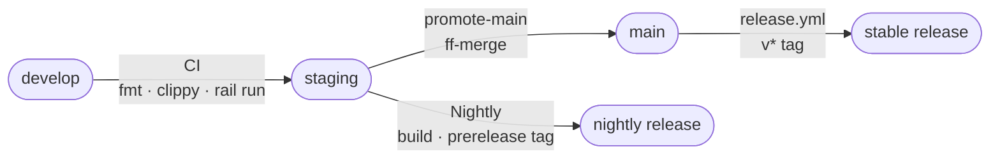
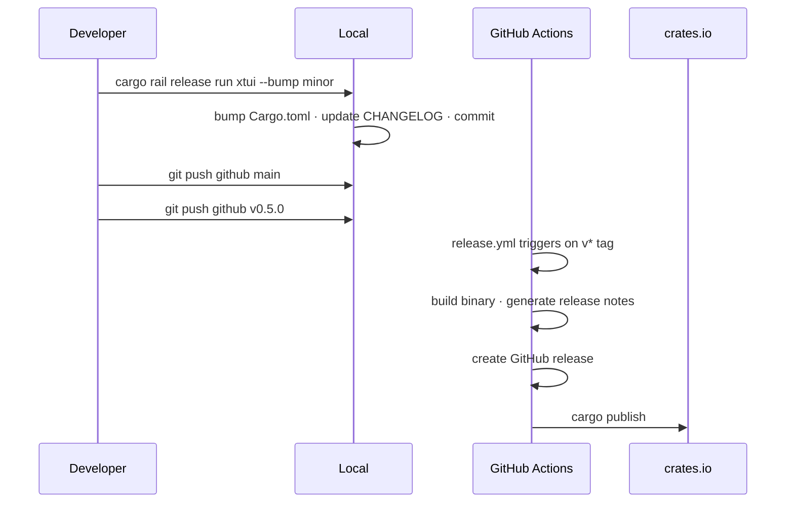

# CI Workflow

## Branch Pipeline

## Surfaces (cargo rail)

| File kind | build | test | docs | infra |
|---|:---:|:---:|:---:|:---:|
| `*.rs` | ✓ | ✓ | | |
| `Cargo.toml` | ✓ | ✓ | | ✓ |
| `.github/**` | | | | ✓ |
| `.gitignore` | | | ✓ | |
| `CHANGELOG.md` | | | ✓ | |
| unclassified | ✓ | ✓ | | ✓ |

`bench` is detected but disabled. `cargo rail run --profile ci` runs build + test + infra surfaces.

## Stable Release

